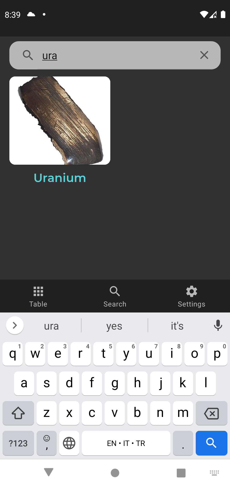
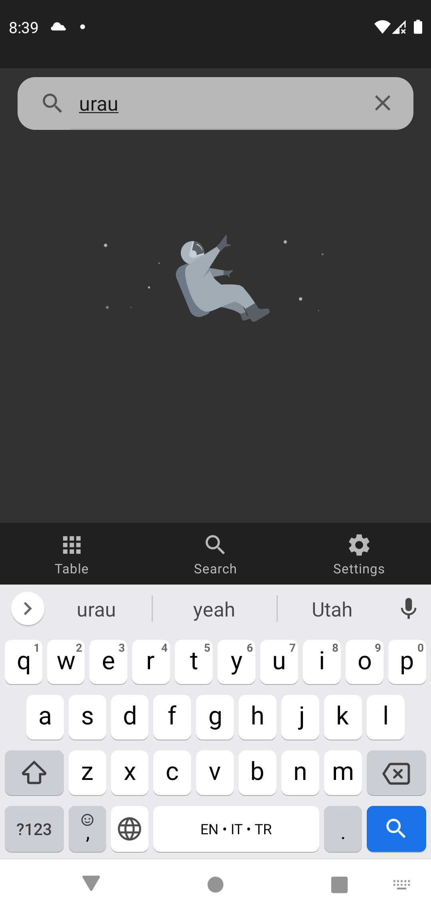

# PeriodicTableApp
### I developed a simple periodic table app. In this project my main library was **recycler view** so there are two different recycler view.

- Each recycler view has its own adapters, which are recycler adapters and list adapters.
- The user can view original periodic table that is colorful by categories (ametal/metal) on a black background.
- When the user click any of them, a dialog window that contains atomic number, shortening, image and name appear.
- The datas was creted by manually. There is nothing about remote service.
- I prefered black and gray colors.
- Also I used nice layout and dialog animations to get better ui.
- There are essential screenshots about app below.

     

       

<pre><code>Copyright 2021 Ahmet Faruk Çuha</code></pre>
